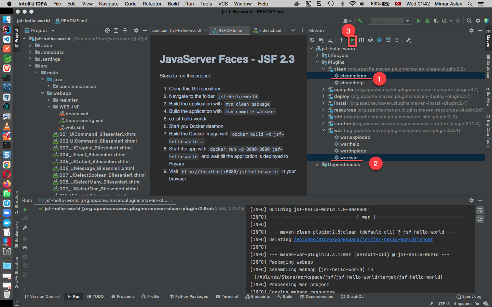
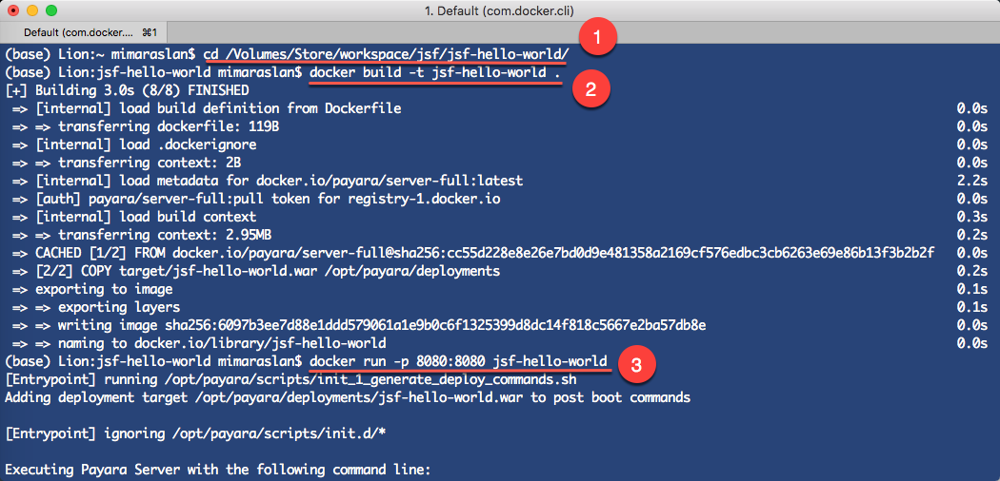
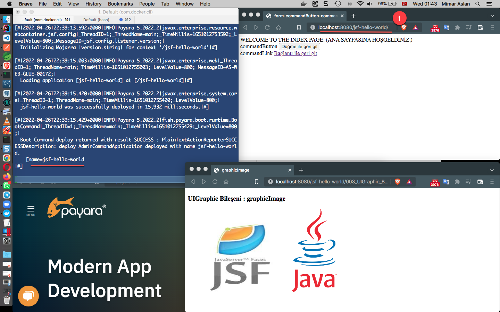
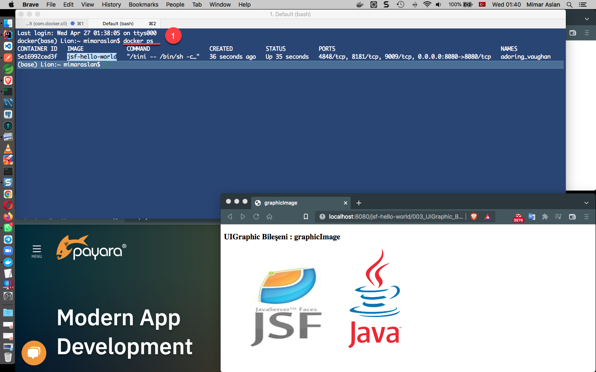

# JavaServer Faces - JSF 2.3 

Steps to run this project:

1. Clone this Git repository
2. Navigate to the folder `jsf-hello-world`
3. Build the application with `mvn clean package`
4. Build the application with `mvn compile war:war`
5. cd jsf-hello-world/
6. Start you Docker deamon
7. Build the Docker image with `docker build -t jsf-hello-world .`
8. Start the app with `docker run -p 8080:8080 jsf-hello-world` and wait till the application is deployed to Payara
9. Visit `http://localhost:8080/jsf-hello-world` in your browser

